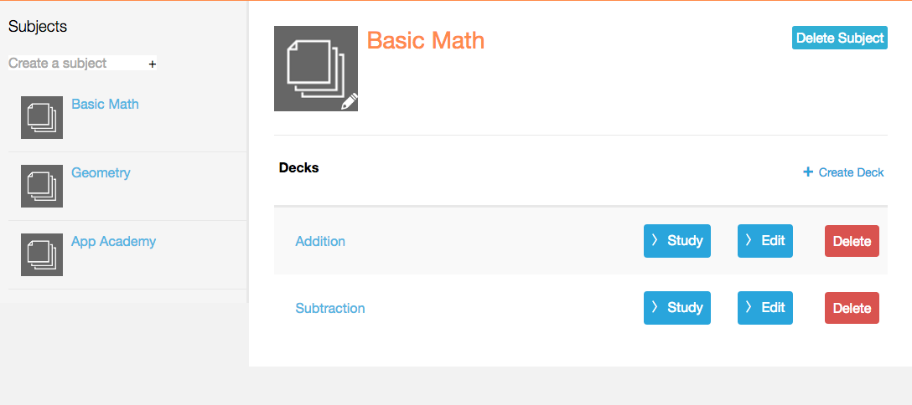
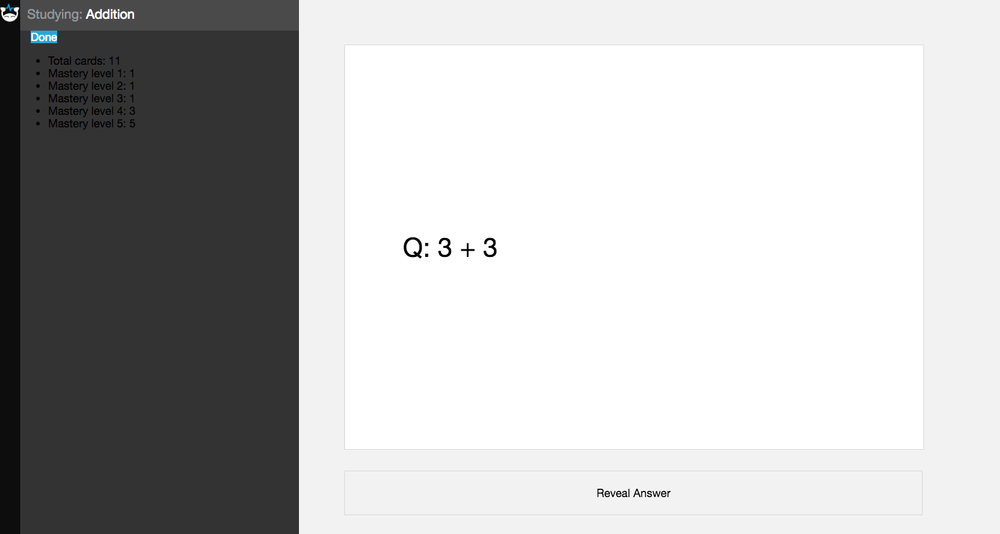
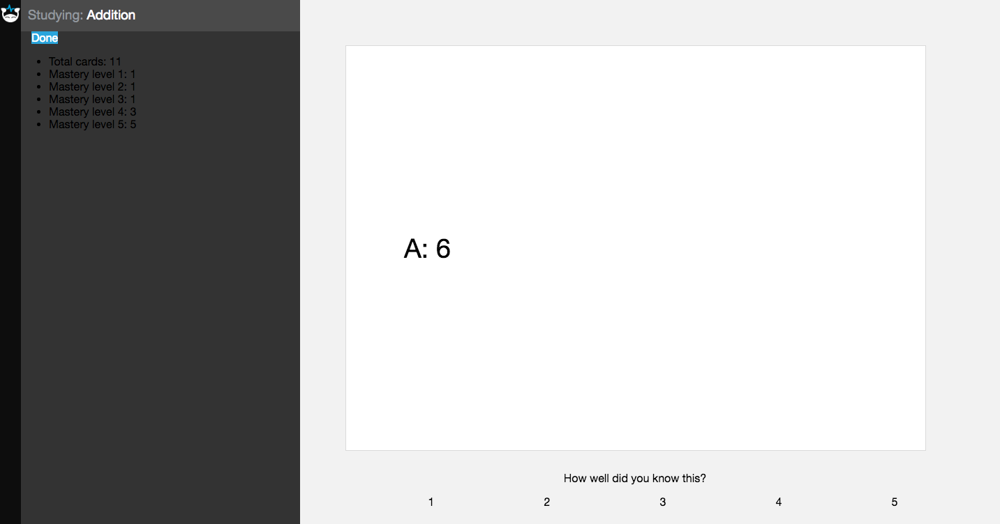

# BrainGain

[Heroku link][heroku]
[heroku]: http://www.braingain.herokuapp.com

BrainGain is a full-stack web application inspired by Brainscape. The application runs a Ruby on Rails backend, a PostgreSQL database, and a  React.js frontend with a Flux architectural framework.

## Features & Implementation

### Single-Page Application

BrainGain is fundamentally a single-page application. The root static page listens to a `SessionStore` and renders all content based on a call to `SessionStore.currentUser()`. The frontend makes an API call to
`SessionsController#create` and therefore does not reveal any private information.

```ruby
class Api::SessionsController < ApplicationController
  def create
    @user = User.find_by_credentials(
      params[:user][:username],
      params[:user][:password]
    )
    if @user
      login(@user)
      render "api/users/show"
    else
      render json: ['Invalid credentials'], status: 401
    end
  end
end
  ```

### Subjects, Decks, and Cards

  Each of these models are stored on their own table in the database. Subjects have a `title` and `author_id`, decks have a `title`, `description` and `subject_id`, and cards have a `question`, `answer`, and `deck_id`. Depending on the component rendered, API calls are made to store data on the frontend.

  The user's person `Library` component renders the `UserSubjectIndex`, which renders `UserSubjectDetail` and `UserDeckIndex` according to the subject selected.



### Masteries

Users must see their recorded level of mastery for each card they view. Masteries include a `user_id` and `card_id`, which are unique as a pair. They also include a mastery value ranging from 1 to 5, with 0 as a default value.

As users interact with the flashcard study environment, they should be able to choose their level of comfort (mastery), and also view their progress in mastering the deck. Along with a respective table on the database, masteries also have a `MasteryStore` for the current deck.

`MasteryStore` method for collecting a user's mastery of a card:

```javascript
MasteryStore.ofCard = (cardId) => {
  let mastery;
  Object.keys(_masteries).forEach( key => {
    if (_masteries[key].card_id === parseInt(cardId)) {
      mastery = _masteries[key];
    }
  });
  return mastery;
};
```

### Flashcards

In a `Study` component, users will enter a dynamic experience in which a `Flashcard` component will render through cards in a deck. The user can choose a level of confidence in mastering a card, and see his/her mastery progress in the `DeckMastery` as the flashcards are studied.

With each flashcard viewed and rated, the `Flashcard` will send an API call to edit the mastery level of the current user and the current card. The `DeckMastery` will listen to the `MasteryStore` and update the progress.





## Future Directions

I plan to continue working on improving and expanding this application in the following ways:

### Subscriptions

Users should be able to subscribe to one another's subjects. With a subscriptions join table in the database between users and subjects, a user should be able to study personally-created and subscribed subjects.

### Search

As the database expands and the number of subjects/decks/cards increases, a search bar will greatly improve the user experience. The search component will go through all public subject titles and render a list of subjects along with deck and card count information.
